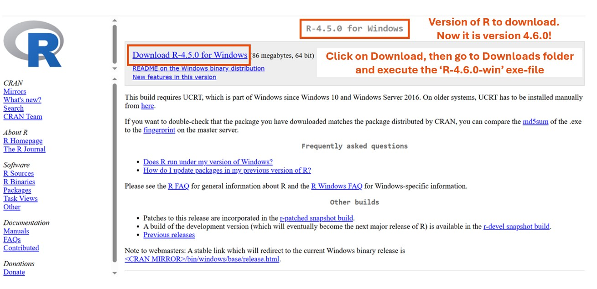

# Session Overview

<!-- 1.  [SBE R Training](#R-team) -->
1.  [What is R?](#what-is-R)
2.  [Installing R](#install-R)
3.  [What is RStudio?](#what-is-RStudio)
4.  [Installing RStudio](#install-RStudio)

# What is R? {#what-is-R}

## What is R?

**R** 

- is an open-source statistical programming language. 
- available for most operating systems
- helps users analyze, visualize, and model data—from simple summaries to complex data analysis
- is extremely popular in statistics and data science, see [this article](http://r4stats.com/articles/popularity/)
- includes thousands of packages (add-ons) that can be used for 
specialized tasks without a deep understanding of the language and programming skills
- allows for extensive programming, making it also suitable for advanced or case-specific applications of statistical methods

The combination of the latter two aspects sets **R** apart and makes it useful for everything ranging from standard 'basic' statistical analysis to the development of new methods.

The homepage of **R** is [www.r-project.org](www.r-project.org) from which you can install **R** and access manuals that provide detailed information about installing and using **R**.

# Installing R {#install-R}

## R Installation
To install **R**, go to the Comprehensive R Archive Network [CRAN](https://cran.r-project.org/). At the time of writing, it looks as follows:

## R Installation on Windows
To download, for instance, **R** for Windows, you arrive at the following page:

## R Installation on Windows
Now download the latest version of **R** (version 4.6.0 at the time of writing):

## R Installation on Windows
Start the download process:

## R Installation on Windows
Continue the download process:

## R Installation on Windows
Download completed:

## R Installation on Mac

Choose the right version for your Mac:

## R Installation on Mac

Download the installation file and open it:

## R Installation on Mac

Simply click continue everywhere, the default installation is fine.

- When asked, enter your password and accept the license agreement.

# What is RStudio? {#what-is-RStudio}

## What is RStudio?

**RStudio**

- is an Integrated Development Environment (IDE) for **R**

- is a user-friendly interface for writing and running **R** code

- makes it easier to write code, analyze data, create visuals, access documentation and manage projects

Its homepage is [https://posit.co/download/rstudio-desktop/](https://posit.co/download/rstudio-desktop/)

# Installing RStudio {#install-RStudio}

## RStudio Installation on Windows

To download **RStudio**, go to its [download](https://posit.co/download/rstudio-desktop/) page. At the time of writing, it looks as follows:

## RStudio Installation on Windows
Start the download process:

## RStudio Installation on Mac
If you open the (same) [download](https://posit.co/download/rstudio-desktop/) page on Mac, you directly see the download button for Mac:

## RStudio Installation on Mac
Open the downloaded RStudio dmg file, and drag the RStudio icon into the applications folder:

